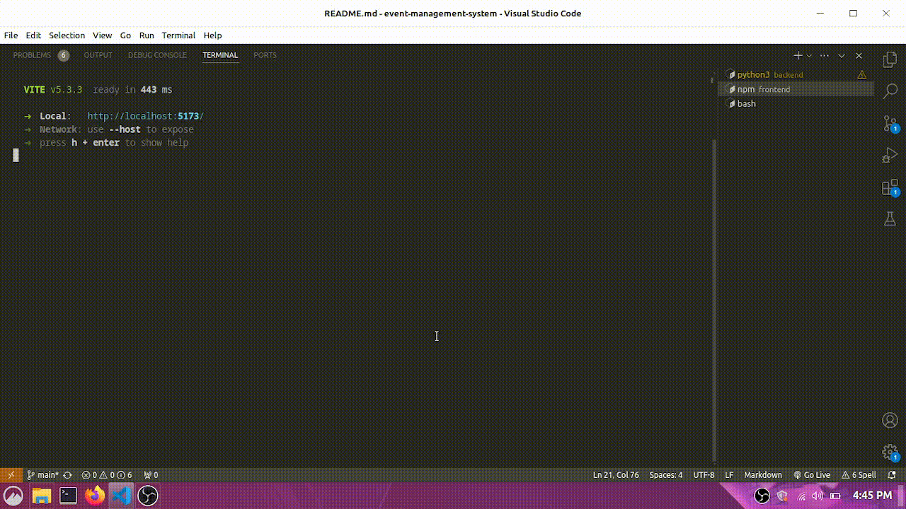

# Event Management System

An event management system is a digital tool that streamlines the planning, organization, and execution of events. It encompasses a range of features.

## Features for organizers:
* View available events on the home page
* Event registration
* CRUD event operations basic analytics for your events

## Features for participants
* View available events on the home page
* Event registration
* View your tickets and delete them if you want.

# Website pages:

* landing: Landing page for website
* login: login page
* register: to register an new user
* home: For showing list of all events, and a button to the management page
* event-preview: preview an event and book tickets
* event-management: For functions relating to the event management page
* event-scheduling: For scheduling new events
* event-updating: For functions relating to updating the details of an event

# Setup:

* Step 1: Open a new terminal in the root folder and then go to 'src/backend' . 
* Step 2: Run the command 'pipenv shell' to start your python virtual environment. Then install the requirements using the commands 'pipenv install django', 'pipenv install djangorestframework' , and 'pipenv install django-cors-headers'
* Step 3: Run the command 'python manage.py runserver' to start the django server.
* Step 4: Open another terminal and go to src/frontend and run the command 'npm install' to install the required dependencies. 
* Step 5: Run the command 'npm run dev' to start the frontend vue.js server.
* Step 6: Open you browser and go to the address 'http://localhost:5173/'

# Testing Credentials:

I have already assigned 3 users for testing. Their username and password is the same.
* test (role: organizer)
* test2 (role: organizer)
* test3 (role: participant)

Make sure to log in as a Organizer so you can get access to the organizer panel.

# Django API Endpoints List:

### auth/api/set-csrf-token
* Description: Set the CSRF cookie on the frontend.
* Method: GET
* Request Body Parameters: None

### auth/api/login
* Description: Mark the user as logged in on the backend.
* Method: POST
* Request Body Parameters:
    - username: Username of the user
    - password: Password of the user

### auth/api/logout
* Description: Mark the user as logged out on the backend.
* Method: POST
* Request Body Parameters: None
Django API Endpoints
### events/api/get-all-events
* Description: Get details about about all the events that currently exist in the database.
* Method: GET
* Request Body Parameters: None

### events/api/get-all-user-organized-events
* Description: Get details about all the events organized by the current logged in user, including ticket stats.
* Method: GET
* Request Body Parameters: None

### events/get-event
* Description: Get details about a particular event.
* Method: POST
* Request Body Parameters:
    - event_id: id of the event for which you want details.

### events/api/create-event
* Description: Adds a new event to the database.
* Method: POST
* Request Body Parameters:
    - eventTitle: Title of the event.
    - Address: Location of the event.
    - eventDesc: Description of the event.
    - startDate: Start Date and Time of the event in UTC format.
    - endDate: End Date and Time of the event in UTC format.

### events/api/update-event
* Description: Updates existing event to the database.
* Method: POST
* Request Body Parameters:
    - event_id: Event ID of the event that needs to be updated.
    - eventTitle: Title of the event.
    - Address: Location of the event.
    - eventDesc: Description of the event.
    - startDate: Start Date and Time of the event in UTC format.
    - endDate: End Date and Time of the event in UTC format.

### events/api/delete-event
* Description: Deletes an event.
* Method: POST
* Request Body Parameters:
    - event_id: Event ID of the event that needs to be deleted.

### events/api/book-event-ticket
* Description: Book a ticket for an event for the currently logged in user.
* Method: POST
* Request Body Parameters:
    - event_id: Event ID of the event for which the ticket has to be booked.

### events/api/get-all-user-tickets
* Description: Get details about all the tickets booked by the current logged in user.
* Method: GET
* Request Body Parameters: None

### events/api/delete-ticket
* Description: Deletes a ticket based on ticket ID.
* Method: POST
* Request Body Parameters:
    - ticket_id: Ticket ID of the ticket that needs to be deleted.
